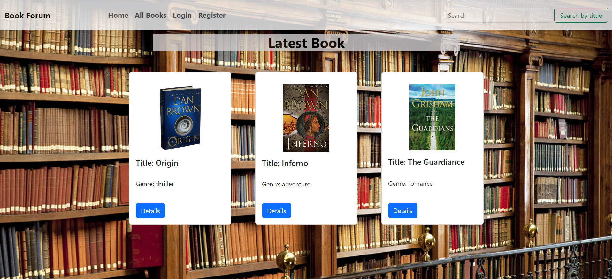

# Book-Forum

## Description

The Book Discussion Forum is a platform designed for book enthusiasts to share and discuss book recommendations. Users can upload information about books they have read and write comments to provide their insights and opinions. The goal of the forum is to foster a community where users can exchange book recommendations and engage in meaningful conversations about literature.

This project uses [React](https://react.dev/) with the [Vite](https://vitejs.dev/) Template



## Features

- **Book Upload:** Users can add details about books they've read, including titles, authors, genres, and summaries.
- **Comments:** Users can write and read comments on books to share their thoughts and recommendations.
- **Search:** Users can search books by tittle.

## Installation and Usage

1. **Clone the Repository:**

   
   There are two folders (client) and ([server](https://github.com/softuni-practice-server/softuni-practice-server/tree/master))<br />
   
   ```bash
   git clone https://github.com/OrlinGichev/Book-Forum.git
   
2. **Start app :**

   Navigate into the project directory:
   Navigate to the client directory and install the dependencies:
   
   ```bash
   cd client
   npm install
   ````
   **Start the Client**

   ```bash
   npm run dev
   ````
   **Start the Server**
   ```bash
   cd server
   node ./server.js
   ````
   
## Project Structure

The project is organized into two main parts:

### Public Part

- **Home:** This is the main landing page accessible to all users. It showcases last 3 books  and allows visitors to view book details with descriptions and comments without needing to log in. User can not to make changes.
- **All boocks:** Displays a list of books with basic details, allowing all users to browse and discover new titles.
- **Search:** User can search some book by tittle.
- **Sign Up/Login:** Users can create an account or log in to access additional features, such as posting comments or adding books.

### Private Part

- **Create book:** Logged-in users can add new books to the forum by providing details such as title, author, genre, and a short description.
- **Commenting System:** Authenticated users can participate in discussions by commenting on books, providing reviews.
- **Details page:** Users can update or delete books details only for book, that they upload.

## Default Users

To help you get started quickly, the project includes two default users with the following credentials:

### User 1: Peter

- **Email:** peter@abv.bg
- **Password:** 123456

### User 2: George

- **Email:** george@abv.bg
- **Password:** 123456

You can use these accounts to log in and explore the private parts of the application, such as  book upload, and commenting system.


## Technologies Used

This project uses the following technologies:

<p align="center">
  
  
  
  
  
</p>


